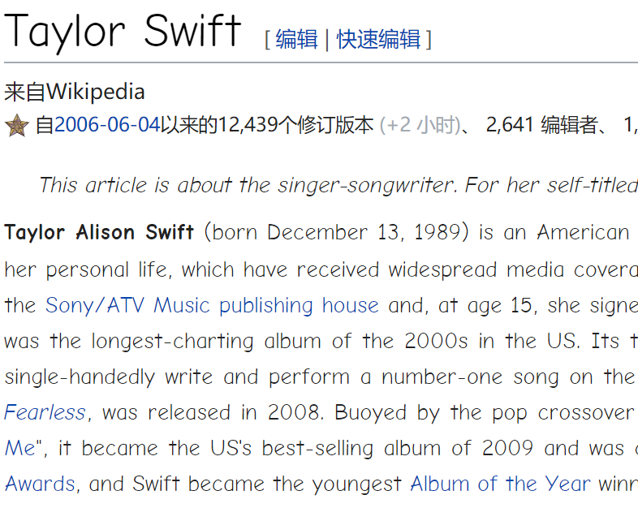
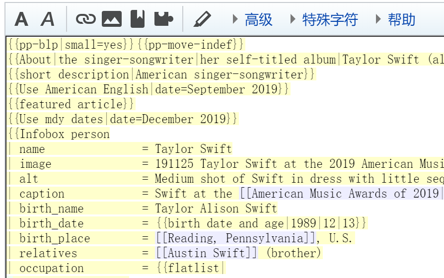

# en_wikipedia_toolkit
This is a toolkit for Wikipedia editors who wish to edit their pages easily.
这个套件是写给那些想更快编写维基百科的人用的。

**Now can only be used in English wikipedia.**
**目前只能用于英文维基百科。**

Then how to use the toolkit?
那么怎么用这个套件呢？

## Guideline 指南
### Fetch the source code of a page. 获取一个页面的源代码。
Clone the python file into your workspace and open a new file, write this code block into your new file:

把这个文件放在工作区中，并在目录中开始一个新程序，在新程序中写入以下代码:
```
#test.py
import en_wikipedia_toolkit
en_wikipedia_toolkit.en_wikipedia_toolkit().fetch_code(page)
```


For example, if one want to fetch the code of the page "Taylor Swift" (an American singer) (with the article pic shown in Fig. 1 and Fig. 2), just run this code:

举个例子，如果一个人想获取"Taylor Swift"（一位美国女歌手）条目（图1和图2分别显示了条目和源代码）的源代码，只需运行这段代码：
```
en_wikipedia_toolkit.en_wikipedia_toolkit().fetch_code("Taylor Swift")
```
Then the result in console will go like this:

那么控制台会输出：
```
Done. The source code was written in 'Taylor Swift.wikitext'.
All processes were done in xxx second(s).
```
And the source code has already been stored in your workspace.
源代码已经存储在你的工作区中了。

### Upload the source code into a page. 将源代码上传至条目中。

**You have to be an autoconfirmed user to ues this toolkit to upload your edition.**

**要上传编辑的话，你必须是一名自动确认用户。**

Step 1. Set your username and password, like the way you do in web browser.
第一步：配置维基账户名称和密码，像你在浏览器访问时一样。

Open 'en_wikipedia_toolkit.py' in editor, jump to Line 75 and 76, set your 'lgname' as your login name and 'lgpassword' as your login password. Like this:

在文本编辑器中打开'en_wikipedia_toolkit.py'，找到第75行和76行，将'lgname'设置为你的登录名，'lgpassword'设置为你的密码。像这样：
```
"lgname": "BrandNew Jim Zhang",
"lgpassword": "********",
```
Done.

配置好了。

Step 2. Upload the wikitext into wikipedia.
第二步：将维基文本上传至维基百科。

Now it's time to upload the wikitext into wikipedia server! Just run this code in the new file:

是时候将维基文本上传至维基百科服务器中了！只需在新文件运行下面的代码：
```
#test.py
import en_wikipedia_toolkit
en_wikipedia_toolkit.en_wikipedia_toolkit().upload(page,path,summary="",minor=False)
```
As for the params and args, the doc says:
对于参数，正如官方文件说的那样：
```
Upload the code of a page.
Page is the page you want to upload to, like 'Taylor Swift' and 'Bill Gates'.
Path is the place where you store the text, both relative and absolute path are OK.

Parameters:
Summary is the way like you did in Wikipedia.
Minor is Boolean, which will identify the edit is minor or not, default False.
```
Now give an example for further explanation, in this example, I try to edit one of my userpage and the source code I submit is the code from Taylor Swift page.

现在举个例子说得更清楚一点，在这个例子中，我试图更改我的的一个用户页，提交的代码是Taylor Swift页面的代码。
```
#test.py
import en_wikipedia_toolkit
en_wikipedia_toolkit.en_wikipedia_toolkit().upload('User:BrandNew Jim Zhang','Taylor Swift.wikitext',summary="test",minor=True)
```
Then the result in console will go like this:

那么控制台会输出：
```
Upload done. See the page on https://en.wikipedia.org/w/index.php?title=User:BrandNew_Jim_Zhang
After uploading, your editcount is 2053.
All processes were done in 19.497 second(s).
```
See, your editcount is also displayed.

看，你的编辑数也会被显示出来。

As for the result, the content has already been changed, shown in Fig. 3 and 4.

内容已经改变了，已在图3和图4中显示出来。

